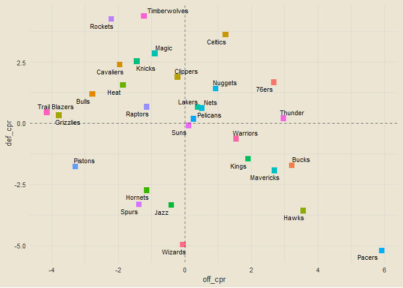

``` r
tictoc::tic() # starts timer

# data frame with all teams and their team ID
team_ids_names = nba_teams |>
  clean_names() |>
  select(team_id, team_name)

# function that takes a date and returns all matchups on that date
get_date_matchups = function(date) {
  x = nba_scoreboard(league_id = "00", game_date = date, day_offset = 0)$GameHeader
  if (nrow(x) == 0) return(NULL)
  return(x |>
    clean_names() |>
    filter(game_status_text == "Final") |>
    transmute(game_date = substr(game_date_est, 1, 10),
              game_id,
              home_team_id, away_team_id = visitor_team_id) |>
    inner_join(team_ids_names, by = c("home_team_id" = "team_id")) |>
    inner_join(team_ids_names, by = c("away_team_id" = "team_id")) |>
    select(game_date, game_id, home_team = team_name.x, away_team = team_name.y))
}

# vector of all dates since beginning of season
loop_dates = as.character(seq.Date(from = as_date("2023-10-24"), to = as_date(Sys.Date() - 1), by = 1))
all_matchups = data.frame() # empty data frame for looping and appending

# loops through every date and adds all matchups from that date to `all_matchups` data frame
for (date in loop_dates) {
  all_matchups = rbind(all_matchups, get_date_matchups(date))
}

# vector of all game IDs
all_game_ids = all_matchups$game_id

# function to get game final score from its game ID
get_game_score_from_id = function(gid) {
  nba_data_pbp(game_id = gid) |>
    filter(de == "End Period") |>
    mutate(wallclk = as_datetime(wallclk)) |>
    slice_max(wallclk, n = 1, with_ties = F) |>
    transmute(game_id = gid, hs, vs)
}

all_results = data.frame() # empty data frame for game results

# looping through all game IDs and adding game results to `all_results`
for (id in all_game_ids) {
  all_results = rbind(all_results, get_game_score_from_id(id))
}

# joining together all matchups and final scores into one data frame
end_games = all_matchups |>
  inner_join(all_results, by = "game_id") |>
  rename(home_score = hs, away_score = vs) |>
  mutate(game_date = as_date(game_date),
         win_team = ifelse(home_score > away_score, home_team, away_team),
         win_score = ifelse(home_score > away_score, home_score, away_score),
         lose_team = ifelse(home_score > away_score, away_team, home_team),
         lose_score = ifelse(home_score > away_score, away_score, home_score),
         desc = paste0(win_team, " def. ", lose_team, " ", win_score, "-", lose_score))

tictoc::toc() # stops timer
```

    ## 214.68 sec elapsed

``` r
all_teams = sort(unique(end_games$home_team))

team_records = data.frame(team = all_teams) |>
  left_join(end_games |>
  count(team = win_team) |>
  rename(wins = n), by = "team") |>
  left_join(end_games |>
  count(team = lose_team) |>
  rename(losses = n), by = "team") |>
  mutate(wins = replace_na(wins, 0),
         losses = replace_na(losses, 0),
         record = paste0(wins, "-", losses),
         pct = round(wins / (wins + losses), 3))

team_records |>
  arrange(desc(pct))
```

    ##             team wins losses record   pct
    ## 1        Celtics   18      5   18-5 0.783
    ## 2   Timberwolves   18      5   18-5 0.783
    ## 3          Bucks   17      7   17-7 0.708
    ## 4          76ers   16      7   16-7 0.696
    ## 5          Magic   16      7   16-7 0.696
    ## 6        Nuggets   17      9   17-9 0.654
    ## 7        Thunder   15      8   15-8 0.652
    ## 8      Mavericks   15      9   15-9 0.625
    ## 9         Lakers   16     10  16-10 0.615
    ## 10         Kings   14      9   14-9 0.609
    ## 11      Clippers   14     10  14-10 0.583
    ## 12       Rockets   12      9   12-9 0.571
    ## 13        Knicks   13     10  13-10 0.565
    ## 14        Pacers   13     10  13-10 0.565
    ## 15          Heat   14     11  14-11 0.560
    ## 16      Pelicans   14     11  14-11 0.560
    ## 17          Nets   13     11  13-11 0.542
    ## 18          Suns   13     11  13-11 0.542
    ## 19     Cavaliers   13     12  13-12 0.520
    ## 20       Raptors   10     14  10-14 0.417
    ## 21      Warriors   10     14  10-14 0.417
    ## 22         Hawks    9     14   9-14 0.391
    ## 23         Bulls   10     16  10-16 0.385
    ## 24          Jazz    9     16   9-16 0.360
    ## 25       Hornets    7     15   7-15 0.318
    ## 26     Grizzlies    6     17   6-17 0.261
    ## 27 Trail Blazers    6     17   6-17 0.261
    ## 28         Spurs    3     20   3-20 0.130
    ## 29       Wizards    3     20   3-20 0.130
    ## 30       Pistons    2     22   2-22 0.083

``` r
get_team_off_ppg = function(team) {
  home = end_games |> filter(home_team == team) |> pull(home_score)
  away = end_games |> filter(away_team == team) |> pull(away_score)
  return(round(mean(c(home, away)), 3))
}

get_team_def_ppg = function(team) {
  home = end_games |> filter(home_team == team) |> pull(away_score)
  away = end_games |> filter(away_team == team) |> pull(home_score)
  return(round(mean(c(home, away)), 3))
}

get_team_total_pts_scored = function(team) {
  home = end_games |> filter(home_team == team) |> pull(home_score)
  away = end_games |> filter(away_team == team) |> pull(away_score)
  return(sum(c(home, away)))
}

get_team_total_pts_allowed = function(team) {
  home = end_games |> filter(home_team == team) |> pull(away_score)
  away = end_games |> filter(away_team == team) |> pull(home_score)
  return(sum(c(home, away)))
}

data.frame(team = all_teams) |>
  mutate(off_ppg = sapply(team, get_team_off_ppg),
         def_ppg = sapply(team, get_team_def_ppg),
         diff = off_ppg - def_ppg) |>
  arrange(desc(diff))
```

    ##             team off_ppg def_ppg    diff
    ## 1          76ers 122.304 113.087   9.217
    ## 2        Celtics 117.348 108.913   8.435
    ## 3   Timberwolves 113.000 105.696   7.304
    ## 4        Thunder 120.478 113.478   7.000
    ## 5          Magic 114.043 108.913   5.130
    ## 6       Clippers 114.417 109.500   4.917
    ## 7        Rockets 109.762 105.524   4.238
    ## 8        Nuggets 114.615 110.500   4.115
    ## 9          Bucks 123.333 119.458   3.875
    ## 10        Knicks 113.087 110.000   3.087
    ## 11     Mavericks 119.417 117.000   2.417
    ## 12        Pacers 127.565 125.391   2.174
    ## 13          Nets 116.250 114.292   1.958
    ## 14          Suns 115.125 113.208   1.917
    ## 15        Lakers 114.308 112.692   1.616
    ## 16          Heat 112.800 111.840   0.960
    ## 17      Pelicans 114.920 114.240   0.680
    ## 18      Warriors 115.458 115.542  -0.084
    ## 19         Kings 116.783 117.130  -0.347
    ## 20     Cavaliers 110.480 110.920  -0.440
    ## 21         Hawks 122.478 123.304  -0.826
    ## 22       Raptors 112.833 114.375  -1.542
    ## 23         Bulls 109.692 113.462  -3.770
    ## 24     Grizzlies 106.435 112.696  -6.261
    ## 25 Trail Blazers 106.826 113.696  -6.870
    ## 26          Jazz 112.000 119.760  -7.760
    ## 27       Hornets 113.000 120.773  -7.773
    ## 28       Pistons 108.750 119.208 -10.458
    ## 29       Wizards 115.870 126.957 -11.087
    ## 30         Spurs 109.826 121.435 -11.609

``` r
team_ppg = data.frame(team = all_teams) |>
  mutate(off_ppg = sapply(team, get_team_off_ppg),
         def_ppg = sapply(team, get_team_def_ppg))

end_with_cpr = end_games |>
  left_join(team_ppg, by = c("home_team" = "team")) |>
  rename(home_off_ppg = off_ppg,
         home_def_ppg = def_ppg) |>
  left_join(team_ppg, by = c("away_team" = "team")) |>
  rename(away_off_ppg = off_ppg,
         away_def_ppg = def_ppg) |>
  mutate(home_exp = (home_off_ppg + away_def_ppg) / 2,
         away_exp = (away_off_ppg + home_def_ppg) / 2,
         home_off_cpr = home_score - home_exp,
         home_def_cpr = away_exp - away_score,
         away_off_cpr = away_score - away_exp,
         away_def_cpr = home_exp - home_score)

end_with_cpr
```

    ## # A tibble: 356 × 21
    ##    game_date  game_id    home_team away_team    home_score away_score win_team 
    ##    <date>     <chr>      <chr>     <chr>             <int>      <int> <chr>    
    ##  1 2023-10-24 0022300061 Nuggets   Lakers              119        107 Nuggets  
    ##  2 2023-10-24 0022300062 Warriors  Suns                104        108 Suns     
    ##  3 2023-10-25 0022300063 Hornets   Hawks               116        110 Hornets  
    ##  4 2023-10-25 0022300064 Pacers    Wizards             143        120 Pacers   
    ##  5 2023-10-25 0022300065 Knicks    Celtics             104        108 Celtics  
    ##  6 2023-10-25 0022300066 Magic     Rockets             116         86 Magic    
    ##  7 2023-10-25 0022300067 Nets      Cavaliers           113        114 Cavaliers
    ##  8 2023-10-25 0022300068 Heat      Pistons             103        102 Heat     
    ##  9 2023-10-25 0022300069 Raptors   Timberwolves         97         94 Raptors  
    ## 10 2023-10-25 0022300070 Bulls     Thunder             104        124 Thunder  
    ## # ℹ 346 more rows
    ## # ℹ 14 more variables: win_score <int>, lose_team <chr>, lose_score <int>,
    ## #   desc <chr>, home_off_ppg <dbl>, home_def_ppg <dbl>, away_off_ppg <dbl>,
    ## #   away_def_ppg <dbl>, home_exp <dbl>, away_exp <dbl>, home_off_cpr <dbl>,
    ## #   home_def_cpr <dbl>, away_off_cpr <dbl>, away_def_cpr <dbl>

``` r
get_team_off_cpr = function(team) {
  home = end_with_cpr |> filter(home_team == team) |> pull(home_off_cpr)
  away = end_with_cpr |> filter(away_team == team) |> pull(away_off_cpr)
  return(round(mean(c(home, away)), 3))
}

get_team_def_cpr = function(team) {
  home = end_with_cpr |> filter(home_team == team) |> pull(home_def_cpr)
  away = end_with_cpr |> filter(away_team == team) |> pull(away_def_cpr)
  return(round(mean(c(home, away)), 3))
}

data.frame(team = all_teams) |>
  mutate(off_cpr = sapply(team, get_team_off_cpr),
         def_cpr = sapply(team, get_team_def_cpr),
         total_cpr = off_cpr + def_cpr) |>
  ggplot(aes(off_cpr, def_cpr)) +
  geom_point(aes(col = team), shape = "square", size = 3, show.legend = F) +
  ggrepel::geom_text_repel(aes(label = team), size = 3, max.overlaps = 30) +
  geom_hline(yintercept = 0, linetype = "dashed", alpha = 0.5) +
  geom_vline(xintercept = 0, linetype = "dashed", alpha = 0.5)
```

<!-- -->
